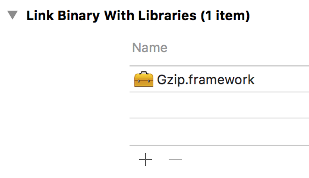
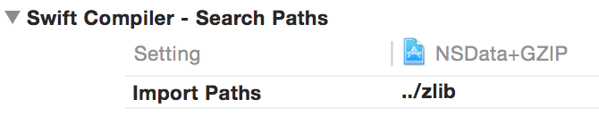

NSData+GZIP.swift
========================

[](https://travis-ci.org/1024jp/NSData-GZIP)

__NSData+GZIP.swift__ is an extension of NSData written in Swift 2.0. It enables compress/decompress gzip using zlib.

- __Requirements__: OS X 10.9 / iOS 7 or later


## Usage

```swift
// gzip
let compressedData : NSData = try! data.gzippedData()

// gunzip
let decompressedData : NSData = try! compressedData.gunzippedData()
```


## Installation

1. Add `NSData+GZIP.swift` file to your project.
2. Add `zlib/` directory to your project.
3. In *Build Phases*, add `libz.tbd` library to your project.
    
4. In *Build Settings* > *Swift Compiler - Search Paths*, Add path to `zlib/` to Import Paths (`SWIFT_INCLUDE_PATHS`).
    
4. Invoke from your Swift/ObjC files.


## Lisence

© 2014-2015 1024jp

NSData+GZIP.swift is distributed under the terms of the __MIT License__. See [LISENCE](LISENCE) for details.