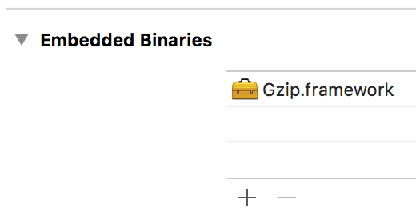

GzipSwift
========================

[]()
[]()
[](https://github.com/Carthage/Carthage)
[](https://swift.org/package-manager/)
[](http://cocoadocs.org/docsets/GzipSwift)
[](https://travis-ci.org/1024jp/GzipSwift)
[](https://codecov.io/gh/1024jp/GzipSwift)
[](https://github.com/1024jp/GzipSwift/blob/develop/LICENSE)

__GzipSwift__ is a framework with an extension of Data written in Swift. It enables compress/decompress gzip using zlib.

- __Requirements__: OS X 10.9 / iOS 8 / watchOS 2 / tvOS 9 or later
- __Swift version__: Swift 3.0.1


## Usage

```swift
import Gzip

// gzip
let compressedData: Data = try! data.gzipped()
let optimizedData: Data = try! data.gzipped(level: .bestCompression)

// gunzip
let decompressedData: Data
if data.isGzipped {
    decompressedData = try! data.gunzipped()
} else {
    decompressedData = data
}
```


## Installation

1. Open Gzip.xcodeproj on Xcode and build Gzip framework for your target platform.
2. Append the built `Gzip.framework` to your project.
3. Go to __General__ pane of the application target in your project. Add `Gzip.framework` to the __Embedded Binaries__ section.
    <br />
4. `import Gzip` in your Swift file and use in your code.

### Carthage
GzipSwift is [Carthage](https://github.com/Carthage/Carthage) compatible. You can easily build GzipSwift adding the following line to your `Cartfile`:

```ruby
github "1024jp/GzipSwift"
```

### CocoaPods
GzipSwift is available through [CocoaPods](http://cocoapods.org). To install
it, simply add the following line to your `Podfile`:

```ruby
pod 'GzipSwift'
```

### Swift Package Manager

1. First you need to install zlib if you haven't installed yet:
   
    ```bash
    $ apt-get install zlib-dev
    ```
2. Add this package to your package.swift.
3. If Swift build failed with a linker error:
    * check if libz.so is in your /usr/local/lib
    * if no, reinstall zlib as step (1)
    * if yes, link the library manually by passing '-Xlinker -L/usr/local/lib' with `swift build`


## Lisence

© 2014-2017 1024jp

GzipSwift is distributed under the terms of the __MIT License__. See [LISENCE](LISENCE) for details.
